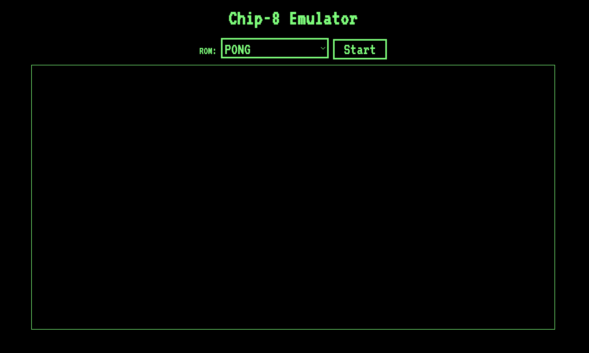

# Chip 

A chip-8 interpreter written in Rust and webAssembly.

## Dependencies:

You need to have [python3](https://www.python.org/downloads/) and 
[rust](https://www.rust-lang.org/tools/install) installed in your computer for this to work.

## How to play: 

1. Clone this repository: `git clone https://github.com/pedrommaiaa/chip8`.

2. Enter the directory: `cd chip8/`.

3. Run `make install` to install all dependencies. 

4. In the main directory, run `make run`.

5. Go to: `http://127.0.0.1:8000/`

6. Choose a game and enjoy.

**Keyboard Layout:**  
| | | | |
|-|-|-|-|
|1|2|3|4|  
|q|w|e|r|  
|a|s|d|f|  
|z|x|c|v|  

  

References:
- [Chip-8](http://devernay.free.fr/hacks/chip8/C8TECH10.HTM). 
- [Chip-8 Book](https://github.com/aquova/chip8-book/releases) 
